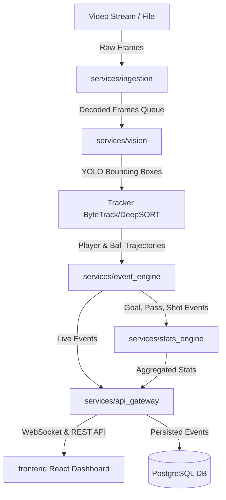

# TurfVision AI — System Architecture & Data Flow

TurfVision AI is a commercial-grade sports computer vision and analytics platform.

## Service Architecture Diagram

## Service Responsibilities

1. **Ingestion Service (`services/ingestion`)**: Decodes MP4/RTSP streams into synchronized OpenCV frame objects with millisecond timestamp markers.
2. **Vision Service (`services/vision`)**: Runs PyTorch/Ultralytics YOLO inference for player and ball detection, followed by ByteTrack trajectory smoothing.
3. **Event Engine (`services/event_engine`)**: Applies deterministic mathematical rules (e.g. vector crossing for goal line, spatial proximity for possession and passes) to emit structured `MatchEvent` payloads.
4. **Statistics Engine (`services/stats_engine`)**: Aggregates continuous spatial telemetry into match analytics (distance run, pass accuracy, possession percentages, heatmaps).
5. **API Gateway (`services/api_gateway`)**: FastAPI server broadcasting live match metrics over WebSockets and providing REST APIs for post-match reports.
6. **Shared Core (`shared/`)**: Shared domain entities, Pydantic schemas, configuration defaults, and structured logging tools.
